# Project set-up
## 1. AWS
We need **IAM** user credential and two **S3** buckets, one for staging and processed data, and the other for **Athena** queries results.


In **Glue** we create three databases representing three layers of data warehouse.


## 2. .env
Prepare necessary environment variables, especially your **AWS** credentials. You can also export these variables before composing.

```toml
# add your desired variables

AWS_ACCESS_KEY_ID=...
AWS_SECRET_ACCESS_KEY=...

AIRFLOW_UID=50000 # airflow user

_AIRFLOW_WWW_USER_USERNAME=...
_AIRFLOW_WWW_USER_PASSWORD=...
_AIRFLOW_WWW_USER_FIRSTNAME=...
_AIRFLOW_WWW_USER_LASTNAME=...
_AIRFLOW_WWW_USER_EMAIL=...

POSTGRES_USER=...
POSTGRES_PASSWORD=...
POSTGRES_DB=...
```

## 3. dbt
Define **AWS** information in _**profiles.yml**_.

```yaml
dbt_project_name:
  outputs:
    dev:
      database: AwsDataCatalog
      region_name: your-aws-region
      s3_data_dir: s3://your-bucket/ # bucket for data lake
      s3_staging_dir: s3://your-athena-queries-bucket/
      schema: "default" # default database in glue
      threads: 8
      type: athena

      # in case dbt cannot recognize aws credentials, explicitly define here 
      aws_access_key_id: ...
      aws_secret_access_key: ...

  target: dev # any names you prefer
```

Define models configs in _**dbt_project.yml**_.

```yaml
models:
  dbt_project_name:
    silver: # staging layer
      +materialized: incremental # upsert table every runs
      +file_format: parquet
      +tblproperties:
        parquet.compression: SNAPPY
        classification: parquet
      +schema: your_silver_db # database in athena

    gold:
      +materialized: table # recreate table every runs
      +file_format: parquet
      +tblproperties:
        parquet.compression: SNAPPY
        classification: parquet
      +schema: your_gold_db

    marts:
      +materialized: view # recreate view every runs
      +schema: your_gold_db
```

Also define bronze (staging) layer in _**schema.yml**_ inside models folder. This can be skipped unless you don't want to pass your bronze database name directly in SQL scripts.

```yaml
sources:
  - name: bronze
    database: AwsDataCatalog
    schema: your_bronze_db
    tables:
      - name: phones
      - name: laptops
      - name: tablets
      - name: watches
      - name: earphones
      - name: screens
```
I created **dbt** project on local machine before containerizing, you can edit the **dags** to initialize it while building **docker** image if you want to.

## 4. Docker and Airflow
Copy your previous _**profiles.yml**_ setup to docker container. This step is crucial for **dbt** to recognize initial environment.

```docker
COPY /your-path/profiles.yml /home/airflow/.dbt/
```

Also mount **dbt** project and necessary directories to container.

```yaml
volumes:
    - ./dags:/opt/airflow/dags
    - ./logs:/opt/airflow/logs
    - ./config:/opt/airflow/config
    - ./plugins:/opt/airflow/plugins
    - ./dbt_project_name:/home/dbt_project_name # dbt project
```

## 5. Build and run Docker image
Before building, remember to replace old setup such as bucket names, directory for landing data, etc. in ***dags/main_dag.py*** by your new setup
```bash
docker compose up airflow-init -d
```
```bash
docker compose up -d
```
Don't set **semaphore** in crawler and scraper over **15**, IP could be banned temporarily.

## 6. Final result
If you set up project correctly you can see the following image and be able to run or trigger the dag.

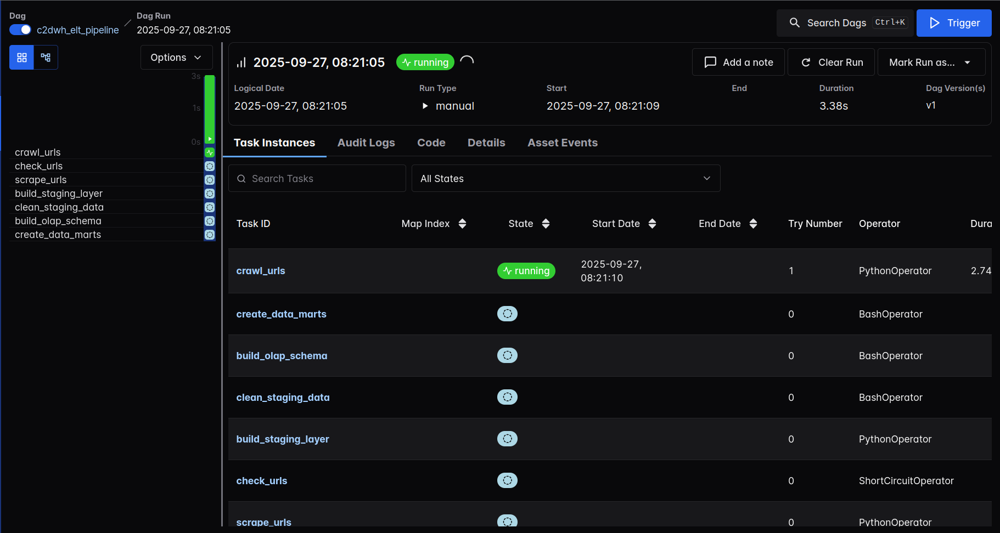

The crawler will continue the previous work (if exists) and only append new found URLs to _**thegioididong_urls.csv**_. The crawling speed depends on speed of internet connection.

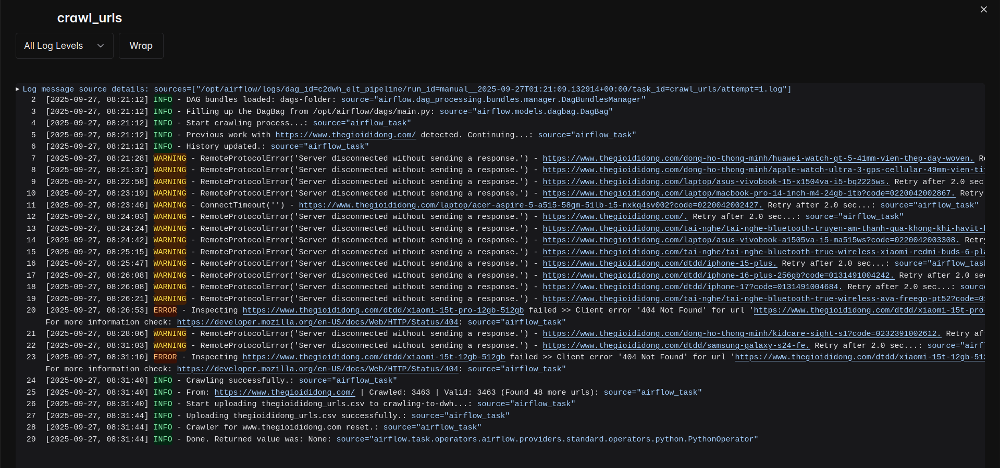
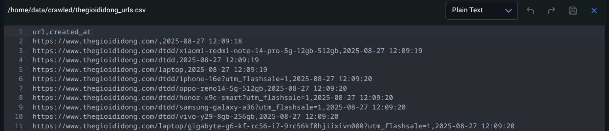

After crawling if there are new URLs then the pipeline will delay 3 minutes to prevent IP being banned before jumping to scraping work, if not, the pipeline will stop here.

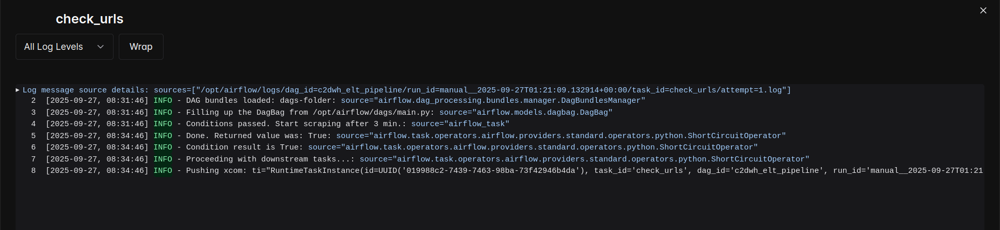

The scraper will start after the delay. 

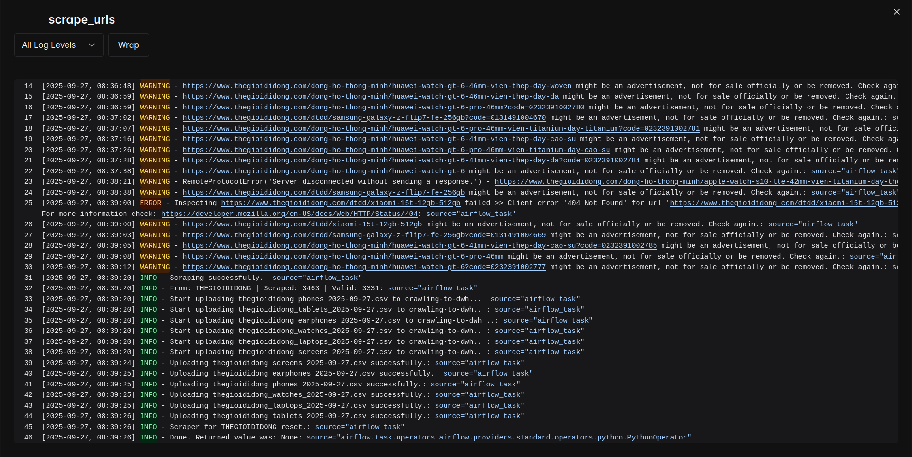
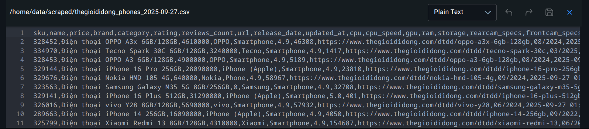

If everything works fine, building staging layer, cleaning data and building schema tasks can run successfully right after scraping work.

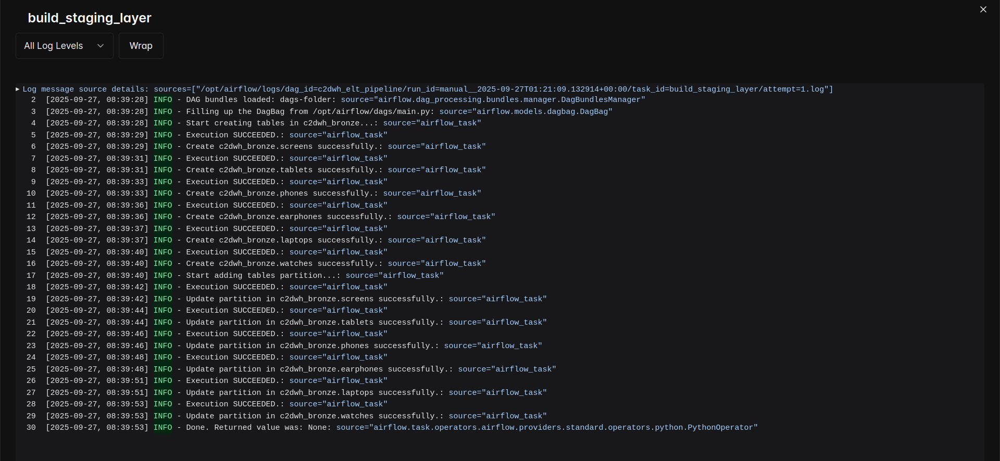
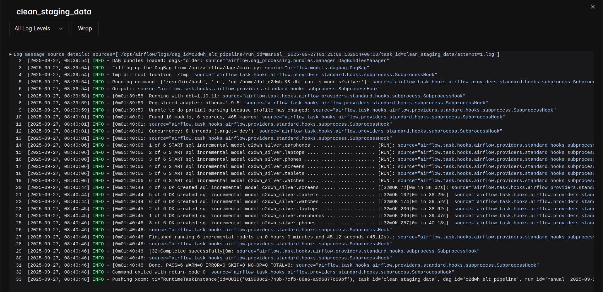
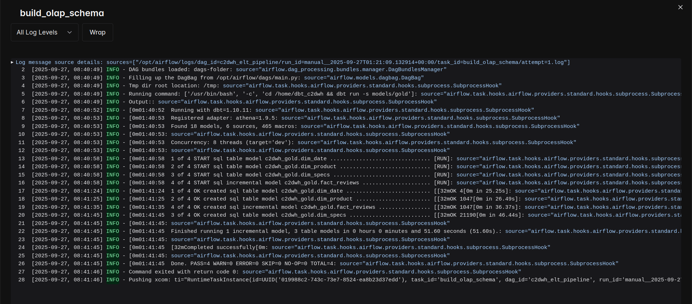
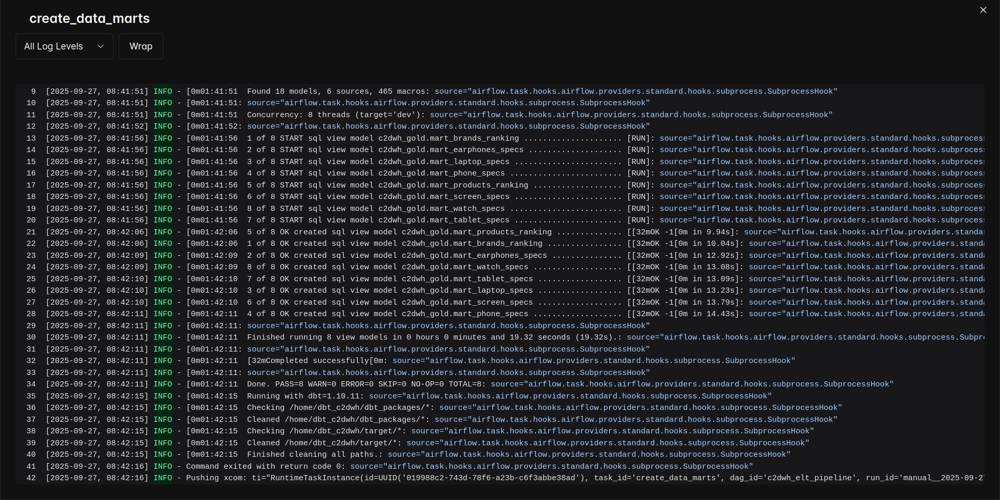

When the all tasks in pipeline finish successfully, you can visit **S3** and **Athena** to check the final result.

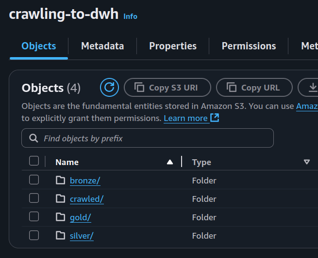
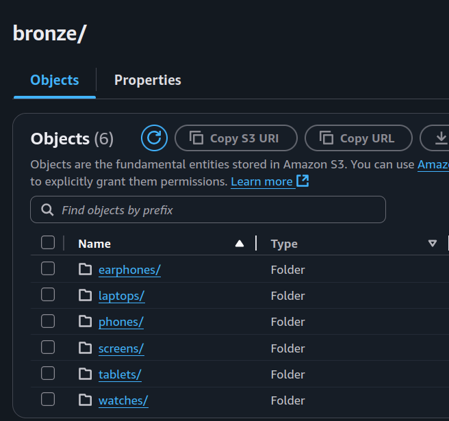
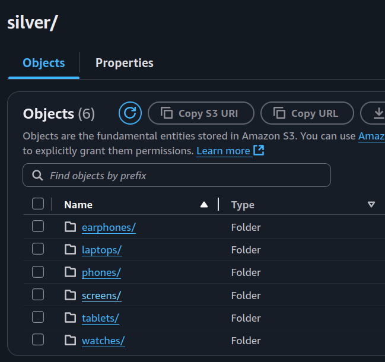
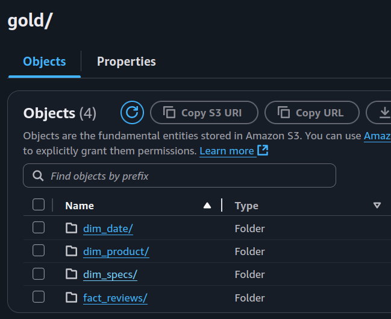

Here is an example of the raw data about laptops

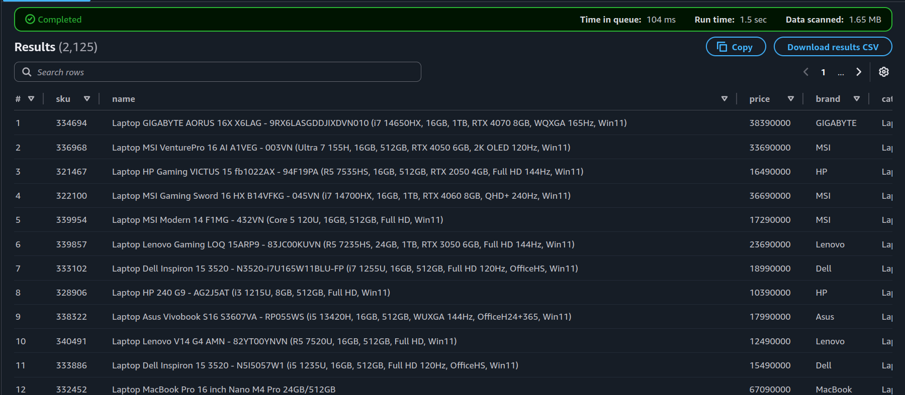

and this is how the data looks like after cleaning

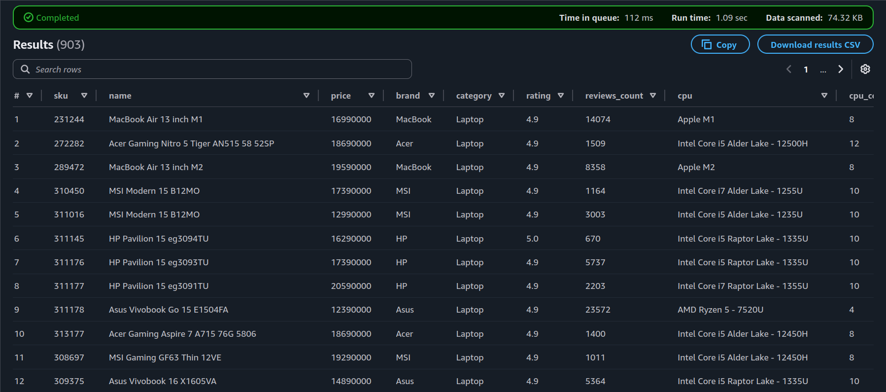

and how it looks like in _**dim_product**_.

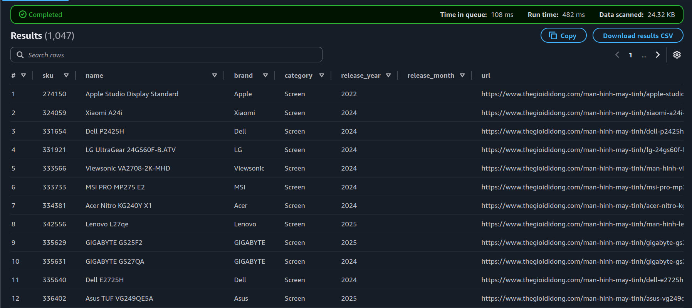

You can explore more once you have successfully run this project. If there are any issues or you want me to improve anything in this project, please let me know via *jayhuynh.as97@gmail.com*. I'm glad to take all of your advices.