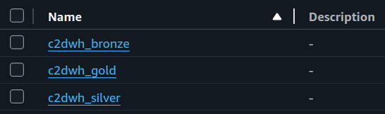

# Project set-up
## 1. AWS
We need **IAM** user credential and two **S3** buckets, one for staging data and one for storing **Athena** queries results.


In **Glue** we create three databases representing three layers of data warehouse.


## 2. dbt
Define **AWS** information in _**profiles.yml**_.

```yaml
dbt_project_name:
  outputs:
    dev:
      database: AwsDataCatalog
      region_name: your-aws-region
      s3_data_dir: s3://your-bucket/ # bucket for data lake
      s3_staging_dir: s3://your-athena-queries-bucket/
      schema: "default" # default database in glue
      threads: 8
      type: athena
      # you can directly define IAM user credential here

  target: dev # any names you prefer
```

Define models configs in _**dbt_project.yml**_.

```yaml
models:
  dbt_project_name:
    silver: # staging layer
      +materialized: incremental # upsert table every runs
      +file_format: parquet
      +tblproperties:
        parquet.compression: SNAPPY
        classification: parquet
      +schema: your_silver_db # database in athena

    gold:
      +materialized: table # recreate table every runs
      +file_format: parquet
      +tblproperties:
        parquet.compression: SNAPPY
        classification: parquet
      +schema: your_gold_db

    marts:
      +materialized: view # recreate view every runs
      +schema: your_gold_db
```

Also define bronze (staging) layer in _**schema.yml**_ inside models folder. This can be skipped unless you don't want to pass your bronze database name directly in SQL scripts.

```yaml
sources:
  - name: bronze
    database: AwsDataCatalog
    schema: your_bronze_db
    tables:
      - name: phones
      - name: laptops
      - name: tablets
      - name: watches
      - name: earphones
      - name: screens
```
I created **dbt** project on local machine before containerizing, you can edit the **dags** to initialize it while building **docker** image if you want to.

## 3. Docker and Airflow
Copy your previous _**profiles.yml**_ setup to docker container.

```docker
COPY /your-path/profiles.yml /home/airflow/.dbt/
```

Also mount **dbt** project to container.

```yaml
volumes:
    - ./dags:/opt/airflow/dags
    - ./logs:/opt/airflow/logs
    - ./config:/opt/airflow/config
    - ./plugins:/opt/airflow/plugins
    - ./dbt_project_name:/home/dbt_project_name # dbt project
```

## 4. Build and run Docker image
Before building, remember to replace old setup such as bucket names, directory for landing data, etc. in **dags/main.py** by your new setup
```bash
docker compose up airflow-init -d
```
```bash
docker compose up -d
```
Don't set **semaphore** in crawler and scraper over **15**, IP could be banned temporarily.

## 5. Final result